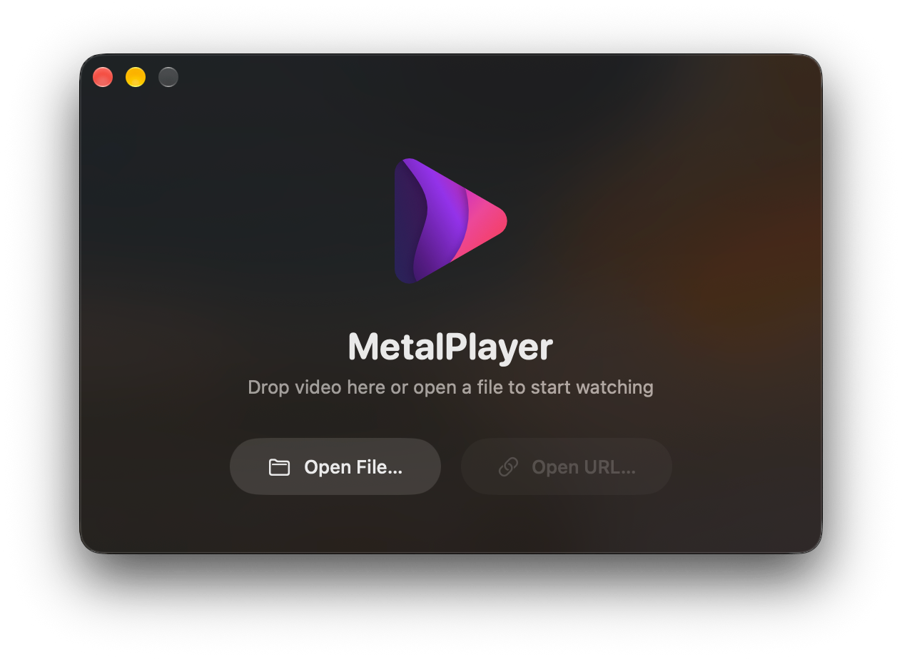

# MetalPlayer

High-performance macOS media player powered by Metal and VideoToolbox with custom HDR tone mapping.



## Features

- **Dual-Engine Rendering**: Direct `AVSampleBufferDisplayLayer` for Apple XDR displays; Metal compute pipeline (BT.2390 EETF tone mapping) for SDR and external displays.
- **HDR Standards**: HDR10, HLG, and Dolby Vision.
- **Hardware Decoding**: VideoToolbox acceleration for HEVC (10-bit) and H.264.
- **Spatial Audio & Multichannel**: 5.1/7.1 multichannel output, Apple Spatial Audio.
<!--- **macOS Integration**: Native window lifecycle, standard keyboard shortcuts, and Control Center integration.-->

## Requirements

- macOS 15.0 (Sequoia) or later
- Apple Silicon
- FFmpeg shared libraries (`brew install ffmpeg`)

## Building & Running

Build and run via Swift Package Manager:
```bash
swift build -c release
```

Package into a signed macOS application bundle:
```bash
./scripts/bundle_app.sh --run
```

Run tests and code formatting:
```bash
swift test
./scripts/format.sh check
```

## License

This project is licensed under the [MIT License](LICENSE).
