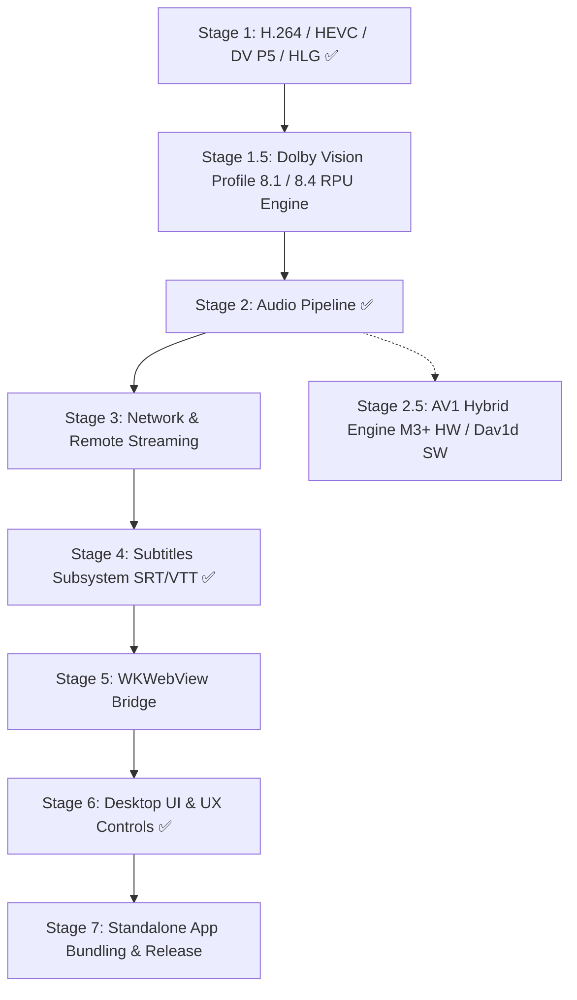

# MetalPlayer: Architecture & Roadmap

This document outlines the architecture, current implementation status, and development roadmap for `MetalPlayer`.
The goal is to evolve the dual-engine video rendering core into a complete standalone media player with audio playback, subtitle rendering, network streaming, and host integration capabilities (e.g., embedding into a `WKWebView`-based Emby/Jellyfin client).

---

## 1. Current Core Status (Completed)

- [x] **Reference Video Pipeline (Dual-Engine Architecture):**
  - **Apple Liquid Retina XDR:** Direct hardware overlay via `AVSampleBufferDisplayLayer` (1000–1600 nits).
  - **SDR / External Displays (e.g. LG UltraFine 5K):** Custom Metal tone-mapping compute shader (ITU-R BT.2390 EETF, 203 nits reference white, Display P3, pure 2.2 gamma, FidelityFX CAS 5x luma-optimized sharpening).
- [x] **Hardware HEVC VideoToolbox Decoder:** P010 biplanar YCbCr, MSB normalization.
- [x] **Dynamic Color Metadata:** Extract primaries/TRC/matrix from FFmpeg `codecpar` and NAL SEI/VUI.
- [x] **Annex B & MP4/HVCC Normalization:** Robust container support for MKV, TS, MP4, and raw HEVC streams.
- [x] **Modular SPM Decomposition:** `MetalPlayerCore` (pure system library without `unsafeFlags`), `MetalPlayerUI`, `MetalPlayerKit`, `MetalPlayerApp`.

---

## 2. MVP Implementation Roadmap

---

### Stage 1: Video Codecs & Formats Expansion — [COMPLETED] ✅
> Evolve from a specialized HEVC demuxer into a versatile video playback engine.

- [x] **1.1. H.264 / AVC Support (SDR 8-bit & 10-bit):**
  - Add `AV_CODEC_ID_H264` support in demuxer.
  - Parse SPS (NAL 7) and PPS (NAL 8) parameter sets.
  - Initialize decompression session via `CMVideoFormatDescriptionCreateFromH264ParameterSets`.
  - Dynamic pixel format selection (`.r8Unorm` vs `.r16Unorm`, Video Range vs Full Range).
  - Direct SDR Metal render pipeline: BT.709 OETF $\to$ Linear BT.709 $\to$ Display P3 with gamma 2.2 and FidelityFX CAS without EETF tone-mapping overhead.
- [x] **1.2. Extended HDR Standards (HLG & Dolby Vision Profile 5):**
  - HLG (Hybrid Log-Gamma, ARIB STD-B67 / BT.2100): Inverse OETF + display-adapted OOTF gamma scaling.
  - Dolby Vision Profile 5: Hardware detection of `dvvC`/`dvcC` atom boxes, IPTc2 / ICtCp unpack $\to$ LMS' $\to$ ST 2084 PQ EOTF $\to$ Linear BT.2020 in nits (eliminates green/purple tint).
- [x] **1.3. Container Extradata Parsing (`avcC` / `hvcC`):**
  - Instant extraction of SPS/PPS/VPS from MP4/MKV extradata headers without needing to scan packet bitstreams.
  - Packet-level scanning retained as a fallback for raw Annex-B streams.
- [x] **1.4. Unified `MediaDemuxer` & Audio Buffering:**
  - Rename `HEVCDemuxer` $\to$ `MediaDemuxer`.
  - Traverse all container streams, extracting audio metadata (`audioStreamIndex`, `audioTimebase`, `audioCodecId`, `audioChannels`, `audioSampleRate`).
  - Implement concurrent `audioQueue` with `nextAudioPacket()`: demux audio concurrently during video traversal, preserving unified disk I/O.

---

### Stage 1.5: Dynamic HDR & Dolby Vision Profile 8 (8.1 / 8.4) Engine
> Dynamic metadata adaptation (SMPTE ST 2094-10) for Web-DL, UHD Blu-ray rips, and iPhone HDR video.

- [x] **1.5.1. Profile Detection & Hardware Decoding:**
  - Parse `dvvC` / `dvcC` configuration boxes from extradata and stream side data (`AV_PKT_DATA_DOVI_CONF`).
  - Distinguish Profile 5 (ICtCp), Profile 8.1 (HDR10 PQ), Profile 8.2 (SDR BT.709), Profile 8.4 (BT.2100 HLG), and Profile 7.
  - Construct Apple-compliant `CMVideoFormatDescription` with `kCMVideoCodecType_DolbyVisionHEVC` (`dvh1`), enabling VideoToolbox hardware decoding of the base layer with `DolbyVisionRPUData` sample buffer attachments.
- [ ] **1.5.2. DOVI RPU Bitstream Parsing (Level 1 Metadata):**
  - Parse Dolby Vision Level 1 (L1) dynamic metadata from RPU payload: frame-accurate `min_pq`, `max_pq`, and `avg_pq`.
- [ ] **1.5.3. Adaptive Scene-by-Scene Tone Mapping:**
  - Forward dynamic L1 target parameters with frame PTS through `FrameQueue`.
  - Feed dynamic shot peak luminance directly into `HDRToneMapping.metal`, adjusting EETF kneepoints on the fly (retaining shadow details in dark scenes without blowing out highlights).

---

### Stage 2: Audio Pipeline & Synchronization — [COMPLETED] ✅
> **Critical MVP milestone.** Seamless high-fidelity audio playback synchronized with video.

- [x] **2.1. Hardware Master Clock Synchronization:**
  - Attach `AVSampleBufferAudioRenderer` to the shared `AVSampleBufferRenderSynchronizer`.
  - Video and audio synchronize against a single CoreAudio hardware timebase, eliminating A/V lip-sync drift.
- [x] **2.2. Audio Demuxing & Decoding (FFmpeg libavcodec + libswresample):**
  - Read audio packets from demuxer's `audioQueue`.
  - Decode via FFmpeg `libavcodec` and resample via `libswresample` to 48kHz Float32 Linear PCM.
  - Apple Spatial Audio & multichannel support: preserve 5.1/7.1 channel layouts with SMPTE/AudioUnit tags (`kAudioChannelLayoutTag_AudioUnit_5_1` / `kAudioChannelLayoutTag_AudioUnit_7_1`) in `CMAudioFormatDescription`.
  - Package PCM into `CMSampleBuffer` with automatic sample size calculation.
- [x] **2.3. Queue Management, Spatial Audio & Control Center Integration:**
  - Non-blocking `audioFeedQueue` feeding `AVSampleBufferAudioRenderer.requestMediaDataWhenReady` with ~0.3s lead time backpressure.
  - Enable `allowedAudioSpatializationFormats = .monoStereoAndMultichannel` for Dynamic Head Tracking on AirPods.
  - Listen for `.AVSampleBufferAudioRendererOutputConfigurationDidChange` and `.AVSampleBufferAudioRendererWasFlushedAutomatically` notifications for instant CoreAudio DSP-graph reconfiguration on Spatial Audio mode switch (*Off / Fixed / Head Tracked*).
  - Multi-track discovery (`audioTracks: [AudioTrack]`) and live track switching (`selectAudioTrack(id:)`).
  - Volume control (`volume: 0.0 ... 1.0`), mute toggle (`isMuted: Bool`), custom UI slider and track picker in `ControlsOverlay`.
  - Flush audio decoder and renderer buffers on seek and track change.
- [x] **2.4. App Bundle Lifecycle & System Integration:**
  - Build and ad-hoc sign `MetalPlayer.app` with `CFBundleIdentifier` (`com.ghotriw.metalplayer`) via `scripts/bundle_app.sh`, enabling macOS Control Center integration.
  - Implement native window controller and `AppDelegate` with `applicationShouldTerminateAfterLastWindowClosed = true` and standard macOS menu shortcuts (`⌘Q`, `⌘W`, `⌘O`).
- [x] **2.5. System Media Controls & Now Playing Integration:**
  - Dual-backend architecture: modern `NowPlaying.framework` (`MediaSession` on macOS 27+) and backward-compatible `MediaPlayer` (`MPNowPlayingInfoCenter` / `MPRemoteCommandCenter`).
  - Remote command handling: Play, Pause, Toggle, Seek/Scrub, and Skip.
  - Hardware & accessory support: Control Center, Menu Bar "Now Playing", keyboard media keys, Touch Bar, and Bluetooth headphones/headsets.
  - Safe timeline extrapolation and seamless window reopen lifecycle.

---

### Stage 2.6: AV1 Hybrid Engine (AOMedia Video 1)
> Apple Silicon M1/M2 chips lack hardware AV1 decoders (introduced in M3/M4+), necessitating a hybrid fallback.

- **2.6.1. Decoder Protocol Abstraction (`VideoDecoderProtocol`):**
  - Common decoder interface enabling transparent switching between hardware `VTVideoDecoder` and software backends.
- **2.6.2. M3/M4+ Hardware Path (VideoToolbox):**
  - Check `VTIsHardwareDecodeSupported(kCMVideoCodecType_AV1)`.
  - Parse `av1C` config atoms and OBUs (Open Bitstream Units).
- **2.6.3. M1/M2 Software Path (`libdav1d`):**
  - Integrate high-performance SIMD/NEON assembly decoder `dav1d` (VideoLAN).
  - Direct zero-copy or fast mapping of `dav1d_data` YUV420P buffers into `CVPixelBuffer` for Metal / DisplayLayer rendering.

---

### Stage 3: Remote Network & Stream Playback (HTTP/HTTPS) — [COMPLETED] ✅
> Enable direct streaming from remote HTTP/HTTPS servers and media endpoints with custom authentication.

- [x] **3.1. Remote URLs & HTTP Headers Support:**
  - Extended demuxer initialization: `MediaDemuxer.init(url: String, headers: [String: String], interruptContext: InterruptContext?)`.
  - Pass custom HTTP request headers to FFmpeg (`AVDictionary` with `"headers"` formatted CRLF, e.g., `Authorization`, `X-Api-Key`, `User-Agent`).
  - Network options: automatic reconnect (`reconnect`, `reconnect_streamed`, `reconnect_delay_max`), 10s microsecond I/O timeouts (`timeout`, `rw_timeout`).
  - Unified protocol support (`http://`, `https://`, and `file://`).
- [x] **3.2. Network Buffering, Interruption & UI Integration:**
  - Track playback loading state (`isLoading: Bool`) and errors (`loadError: String?`), displaying non-blocking spinner and error banner.
  - Implement FFmpeg interrupt callbacks (`AVIOInterruptCB` via `InterruptContext`) to cleanly cancel/abort network connections on window close or playback stop without freezing UI or worker threads.
  - Asynchronous background engine loading (`loadAsync(path:headers:)`).
  - CLI argument parsing for `--header="Key: Value"` and `--header "Key: Value"` in `PlayerConfiguration`.
  - Modern "Open URL…" modal sheet with preset headers (`Authorization`, `X-Api-Key`, `User-Agent`), menu shortcut `⌘U`, and quick-access button in `WelcomeView`.

---

### Stage 4: Subtitles Subsystem (Text & Embedded Subtitles) — [COMPLETED] ✅
> High-performance subtitle overlay for foreign language content with customizable appearance and positioning.

- [x] **4.1. Text-based Subtitle Parsers (SRT, WebVTT):**
  - Robust parser for standard SubRip (`.srt`) and WebVTT (`.vtt`) files.
  - Cleans HTML tags (`<b>`, `<i>`, `<u>`, ``) and raw styling directives while preserving timing.
  - $O(\log N)$ binary search for active cue retrieval matching presentation timestamp (PTS).
- [x] **4.2. Embedded Subtitle Demuxing:**
  - Traversal and extraction of subtitle streams (`AVMEDIA_TYPE_SUBTITLE`) from MKV and MP4 containers.
  - Support for `subrip` (SRT), `webvtt`, and `mov_text`.
  - Detection of track metadata (language codes, titles, `isForced`, `isSDH` tags).
- [x] **4.3. Alignment Directives & Positioning:**
  - Parsing ASS/SSA alignment tags (`{\an1}` – `{\an9}`, `{\a1}` – `{\a11}`).
  - Dynamic positioning in `SubtitleOverlayView`: top-aligned dialogs (`\an8`, `\an7`, `\an9`) render at top of screen without obscuring bottom subtitles.
  - Full-surface overlay ignoring macOS window safe area margins for symmetric top/bottom layout.
- [x] **4.4. UI Controls & User Appearance Customization:**
  - Track picker in `ControlsOverlay` with "Off", embedded tracks, and "Load Subtitle File…" panel.
  - Expanded Settings dialog with dedicated **Subtitles** tab.
  - Live interactive preview with dark movie gradient.
  - Configurable font size (16–54 pt), text color, background box color, and background opacity (0%–100%).
  - Persistence across sessions via `UserDefaults` / `PlayerConfiguration`.
- [ ] **4.5. Advanced ASS/SSA Styling & Bitmap Subtitles:**
  - Full ASS drawing/typesetting support via `libass` integration.
  - Bitmap subtitle overlays: PGS (Blu-ray `hdmv_pgs_subtitle`) and VOBSUB (DVD).

---

### Stage 5: Host Integration Bridge (WKWebView Two-Way Bridge)
> Enable embedding MetalPlayer as a native high-performance rendering backend inside hybrid web applications.

- **5.1. Embedded Native Video Canvas:**
  - `NativeVideoHostView` as an embeddable `NSView` without intrusive UI chrome.
  - Transparent `WKWebView` overlay delegating mouse and keyboard gestures seamlessly.
- **5.2. Two-Way Bridge API Contract:**
  - **Commands IN (JS -> Native):**
    - `open(url, headers)`
    - `play()`, `pause()`, `seek(seconds)`
    - `setVolume(level)`, `setAudioTrack(id)`, `setSubtitleTrack(id)`
    - `setToneMapParams(exposure, shadowLift, sharpness)`
  - **Events OUT (Native -> JS via `messageHandlers`):**
    - `onTimeUpdate({ currentTime, duration, buffered })`
    - `onStateChange({ state: 'playing' | 'paused' | 'buffering' | 'ended' })`
    - `onTracksLoaded({ audioTracks, subtitleTracks })`
    - `onError({ code, message })`

---

### Stage 6: Desktop UI & UX Controls (SwiftUI Player Experience) — [COMPLETED] ✅
> Polished, distraction-free desktop media player interface.

- [x] **6.1. Fullscreen Behavior & Cursor Autohide:**
  - Auto-hide mouse cursor via `NSCursor.setHiddenUntilMouseMoves(true)` and controls overlay after 2.5 seconds of user inactivity.
  - Double-click on video surface to toggle fullscreen (with controls overlay click isolation).
  - Native macOS borderless fullscreen mode with auto-hiding traffic lights.
- [x] **6.2. Hardware Keyboard Shortcuts (Layout-Independent):**
  - Low-level ANSI keycode interception in `PlayerWindow` (layout-independent: works reliably on Russian, English, and other layouts).
  - `Space` — Play / Pause.
  - `Left` / `Right` — Seek backward / forward (5 seconds).
  - `Option + Left` / `Option + Right` or `,` / `.` — Single frame step (1/24s).
  - `Up` / `Down` — Volume adjustment (±5%).
  - `M` — Mute toggle.
  - `D` / `⌘I` — Performance HUD toggle.
  - `F` / `⌃⌘F` — Fullscreen toggle.
  - `Esc` — Exit fullscreen.
  - Active text input protection: key events bypass player shortcuts when typing in `NSTextView` / `NSText`.

---

### Stage 7: Standalone App Bundling & Release Packaging
> Eliminate developer environment dependencies (Homebrew FFmpeg) for zero-friction distribution to end users.

- **7.1. Dynamic Library Bundling (Dylib Bundling):**
  - Populate `Contents/Frameworks` within `MetalPlayer.app`.
  - Copy required FFmpeg dylibs (`libavformat`, `libavcodec`, `libavutil`, `libswresample`) and their transitive dependencies.
  - Rewrite dynamic linker paths using `install_name_tool`: replace hardcoded `/opt/homebrew/...` paths with `@rpath` (`@executable_path/../Frameworks`).
  - Configure `LC_RPATH` (`@loader_path/../Frameworks`) in `MetalPlayer` executable.
- **7.2. CI Automation & Release Artifacts:**
  - Add `--standalone` / `--release` flags to `scripts/bundle_app.sh`.
  - Validate bundle with `otool -L`: verify zero references to non-system directories outside `/System/Library` and `/usr/lib`.
  - Package compressed DMG / ZIP distribution archives automatically via GitHub Actions CI.
